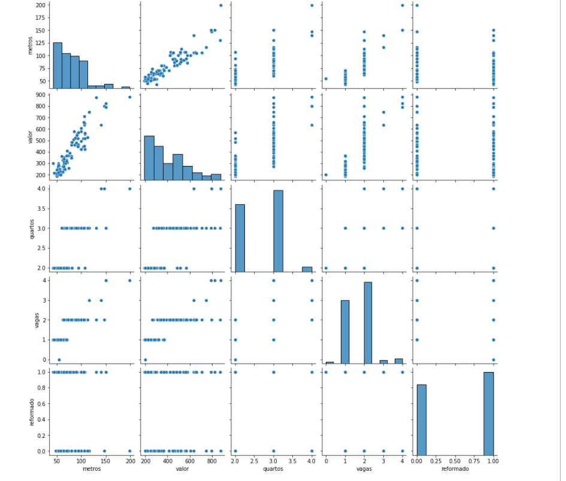
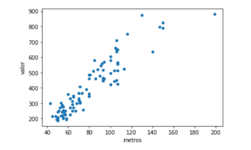

# CP1-IA
CheckPoint1 / NAC-1 da Matéria Disruptive Architectures Iot, Iob e IA
<hr>

# Projeto IA-GK
<p><b>Nome dos alunos:</b> Gabriel Sun - RM:88316 e Kleber Albert - RM:88711</p>
<p><b>Turma:</b> 2TDSJ - Análise e Desenvolvimento de Sistemas</p>
<p><b>Ano:</b> 2ºAno - 2022</p>
<hr> 

# Objetivo / descrição do Projeto
<p>Projeto desenvolvido para que empresas do ramo imobiliário possam consultar informações de apartamentos de acordo com sua necessidade. Por exemplo: saber a média de preço
de apartamentos com 1 quarto em um determinado bairro.</p>
<p>Inicialmente foi desenvolvido uma solução para encontrar o valor de um um apartamento de 65m2 com 2 quartos, 2 vagas, reformado no Centro.</p>

<h2>Tecnologias Utilizadas</h2>
<ul>
  <li>Python</li>
</ul>
<hr>

# Diagrama do projeto
<p>Imagens de alguns gráficos gerados no projeto.</p>
  <p align="center">
    
    
</p>
<hr>

# Como usar
<p>Você deve instalar o <b>Python 3</b> na sua máquina e as seguintes bibliotecas:</p>

```
python -m pip install -U pip
pip install seaborn
python -m pip install -U matplotlib
pip install pandas
pip install numpy
pip install -U scikit-learn
```

<p>Para iniciar o Jupyter Notebook:</p>
```
jupyter notebook
```


<p><b>Código para clonar repositório:</b></p>

```
git clone https://github.com/BielSunn/CP1-IA.git
```
<hr>

# Link de vídeo demonstração
[Link vídeo Youtube](https://youtu.be/hDaDw7-hbv8)

# Referências

[Sintaxe básica de escrita e formatação no GitHub](https://docs.github.com/pt/get-started/writing-on-github/getting-started-with-writing-and-formatting-on-github/basic-writing-and-formatting-syntax)

[Guia básico de Markdown](https://docs.pipz.com/central-de-ajuda/learning-center/guia-basico-de-markdown#open)
